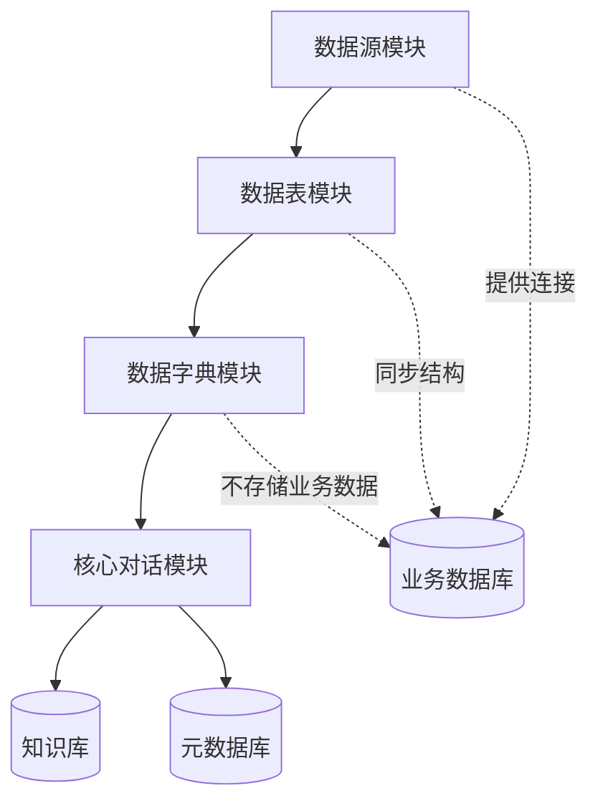
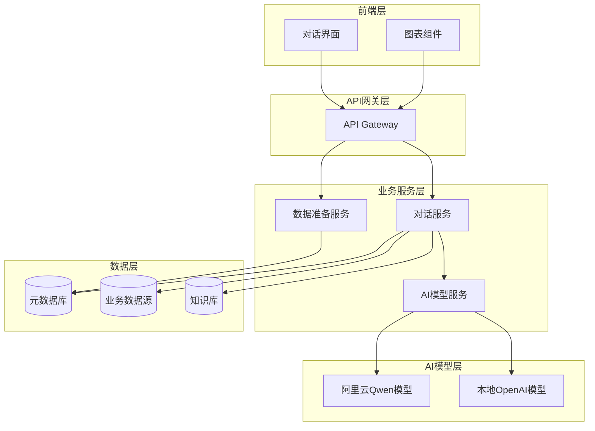
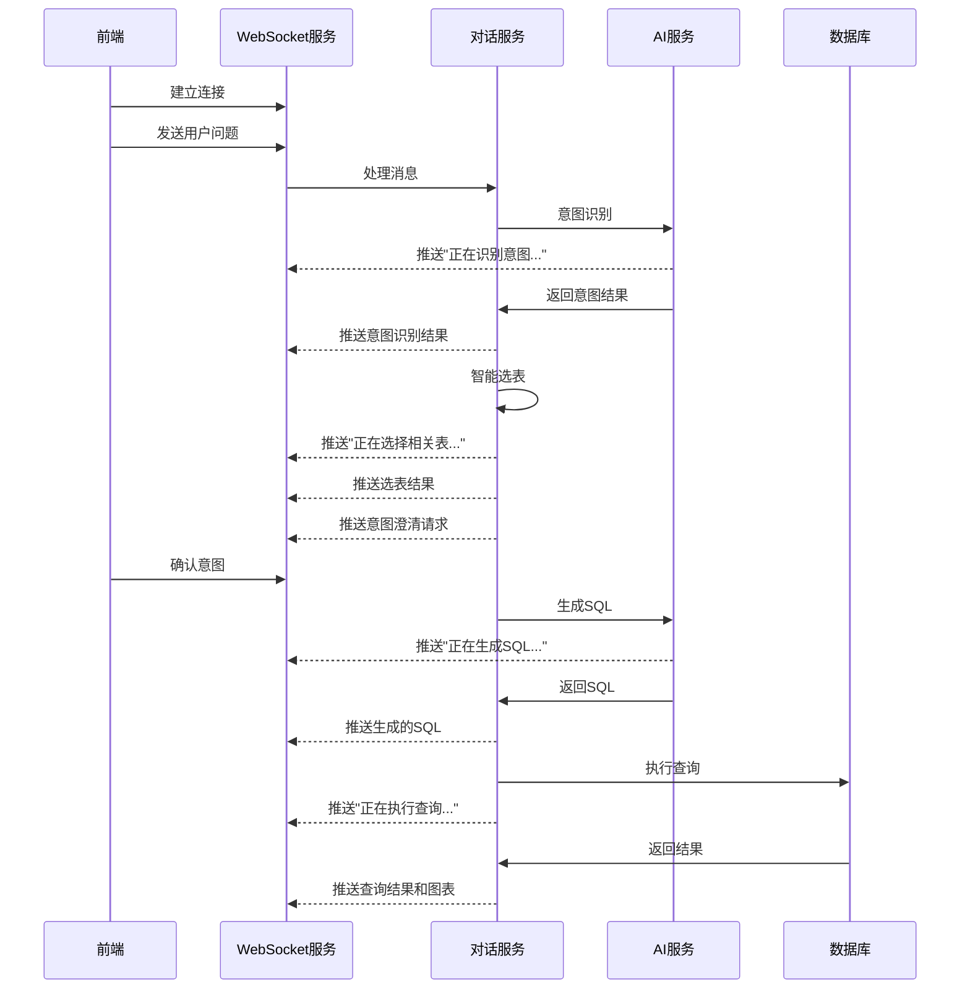

# ChatBI 核心功能设计文档

## 概述

ChatBI 是一个智能数据分析对话系统，通过自然语言交互为用户提供数据查询和分析服务。系统采用模块化架构，包含数据准备模块（数据源、数据表、数据字典）和核心对话模块（意图识别、智能选表、SQL生成、流式响应）。

## 模块依赖关系



**依赖说明**：
- 数据表模块依赖数据源模块，需要数据源连接来发现和同步表结构
- 数据字典模块依赖数据表模块，为已同步的表字段提供业务含义
- 核心对话模块依赖前三个模块，整合所有元数据进行智能分析
- 系统不存储业务数据，仅存储表结构和字典等元数据

## 架构设计

### 系统架构图



### 核心模块设计

#### 1. 数据准备模块

**数据源管理**
- 支持 MySQL 和 SQL Server 连接
- 连接池管理和状态监控
- 连接配置的加密存储

**数据表管理**
- 自动表发现和结构同步
- 表结构元数据存储
- 依赖数据源，不存储实际业务数据

**数据字典管理**
- 字段业务含义管理
- 层级字典结构
- 导入导出功能
- 依赖数据表，为表字段提供业务语义

#### 2. 核心对话模块

**意图识别服务**
- 智能问数 vs 生成报告分类
- 基于关键词和语义的意图分析
- 意图识别准确率监控

**智能选表服务**
- 多源数据整合（知识库+表结构+数据字典）
- 关键词匹配和语义相似度计算
- 候选表排序和推荐理由生成

**SQL生成服务**
- 基于Qwen模型的SQL生成
- 上下文感知的查询优化
- SQL安全性验证

**流式响应服务**
- WebSocket实时通信
- 分阶段内容推送
- 断点续传支持

## 组件和接口设计

### 1. 数据准备服务接口

```typescript
interface DataSourceService {
  // 数据源管理
  createDataSource(config: DataSourceConfig): Promise<DataSource>
  testConnection(config: DataSourceConfig): Promise<ConnectionResult>
  listDataSources(): Promise<DataSource[]>
  updateDataSource(id: string, config: DataSourceConfig): Promise<DataSource>
  deleteDataSource(id: string): Promise<void>
  
  // 表结构同步
  discoverTables(dataSourceId: string): Promise<TableInfo[]>
  syncTableStructure(dataSourceId: string, tableNames: string[]): Promise<SyncResult>
  getTableStructure(tableId: string): Promise<TableStructure>
  
  // 数据字典管理
  createDictionary(dictionary: Dictionary): Promise<Dictionary>
  updateFieldMapping(fieldId: string, mapping: FieldMapping): Promise<void>
  exportDictionary(dictionaryId: string, format: 'excel' | 'csv'): Promise<Buffer>
  importDictionary(dictionaryId: string, file: Buffer): Promise<ImportResult>
}
```

### 2. 对话服务接口

```typescript
interface ChatService {
  // 对话管理
  createSession(): Promise<ChatSession>
  sendMessage(sessionId: string, message: string): Promise<void>
  getSessionHistory(sessionId: string): Promise<ChatMessage[]>
  
  // 意图识别
  identifyIntent(message: string): Promise<IntentResult>
  
  // 智能选表
  selectTables(intent: IntentResult, context: ChatContext): Promise<TableSelection>
  
  // 意图澄清
  clarifyIntent(selection: TableSelection): Promise<ClarificationResponse>
  
  // SQL生成和执行
  generateSQL(clarifiedIntent: ClarifiedIntent): Promise<SQLResult>
  executeQuery(sql: string, dataSourceId: string): Promise<QueryResult>
  
  // 本地追问
  askLocalModel(queryResult: QueryResult, question: string): Promise<AnalysisResult>
}
```

### 3. 流式响应接口

```typescript
interface StreamService {
  // 流式通信
  establishConnection(sessionId: string): Promise<WebSocket>
  sendStreamChunk(sessionId: string, chunk: StreamChunk): Promise<void>
  closeStream(sessionId: string): Promise<void>
}

interface StreamChunk {
  type: 'thinking' | 'result' | 'chart' | 'error'
  content: string
  metadata?: any
  timestamp: number
}
```

## 数据模型设计

### 1. 数据源模型

```typescript
interface DataSource {
  id: string
  name: string
  type: 'mysql' | 'sqlserver'
  config: {
    host: string
    port: number
    database: string
    username: string
    password: string // 加密存储
    connectionPool?: {
      min: number
      max: number
      timeout: number
    }
  }
  status: 'active' | 'inactive' | 'error'
  createdAt: Date
  updatedAt: Date
}
```

### 2. 数据表模型

```typescript
interface DataTable {
  id: string
  dataSourceId: string // 依赖数据源
  name: string
  schema?: string
  comment?: string
  fields: TableField[]
  lastSyncAt: Date
  createdAt: Date
}

interface TableField {
  id: string
  tableId: string
  name: string
  type: string
  nullable: boolean
  comment?: string
  businessName?: string // 来自数据字典
  businessMeaning?: string // 来自数据字典
}
```

### 3. 数据字典模型

```typescript
interface Dictionary {
  id: string
  name: string
  code: string
  type: 'static' | 'dynamic'
  parentId?: string
  items: DictionaryItem[]
  createdAt: Date
  updatedAt: Date
}

interface DictionaryItem {
  id: string
  dictionaryId: string
  key: string
  value: string
  description?: string
  order: number
}

interface FieldMapping {
  fieldId: string // 依赖数据表字段
  dictionaryId?: string
  businessName: string
  businessMeaning: string
  valueRange?: string
}
```

### 4. 对话模型

```typescript
interface ChatSession {
  id: string
  userId?: string
  status: 'active' | 'closed'
  context: ChatContext
  messages: ChatMessage[]
  createdAt: Date
  updatedAt: Date
}

interface ChatMessage {
  id: string
  sessionId: string
  type: 'user' | 'assistant' | 'system'
  content: string
  metadata?: {
    intent?: IntentResult
    tableSelection?: TableSelection
    sqlResult?: SQLResult
    queryResult?: QueryResult
  }
  timestamp: Date
}

interface ChatContext {
  selectedTables: string[]
  recentQueries: string[]
  userPreferences: any
}
```

## 核心功能设计

### 1. 意图识别服务

基于Qwen模型的意图识别，通过精心设计的prompt让大模型进行分类：

```typescript
class IntentService {
  async identifyIntent(message: string): Promise<IntentResult> {
    const prompt = this.buildIntentPrompt(message)
    const response = await this.qwenClient.generate(prompt)
    return this.parseIntentResponse(response)
  }
  
  private buildIntentPrompt(message: string): string {
    return `
请分析用户的问题，判断用户的意图类型：

用户问题：${message}

请从以下两种意图中选择一种：
1. 智能问数：用户想要查询具体的数据，获取数值、统计结果等
2. 生成报告：用户想要生成综合性的分析报告或总结

请以JSON格式返回结果：
{
  "intent": "query" | "report",
  "confidence": 0.0-1.0,
  "reasoning": "判断理由"
}
`
  }
}
```

### 2. 智能选表服务

基于Qwen模型的表选择，整合所有元数据让大模型进行智能匹配：

```typescript
class TableSelectionService {
  async selectTables(
    message: string, 
    intent: IntentResult,
    context: {
      tables: TableMetadata[],
      dictionaries: Dictionary[],
      knowledgeBase: KnowledgeItem[]
    }
  ): Promise<TableSelection> {
    const prompt = this.buildTableSelectionPrompt(message, intent, context)
    const response = await this.qwenClient.generate(prompt)
    return this.parseTableSelection(response)
  }
  
  private buildTableSelectionPrompt(
    message: string, 
    intent: IntentResult,
    context: any
  ): string {
    return `
基于用户问题和可用的数据资源，请选择最相关的数据表：

用户问题：${message}
意图类型：${intent.type}

可用数据表：
${this.formatTablesForPrompt(context.tables)}

数据字典：
${this.formatDictionariesForPrompt(context.dictionaries)}

业务知识库：
${this.formatKnowledgeForPrompt(context.knowledgeBase)}

请分析用户问题中的关键词，结合表结构、字段含义和业务知识，选择最相关的表。

请以JSON格式返回结果：
{
  "selectedTables": [
    {
      "tableId": "表ID",
      "tableName": "表名",
      "relevanceScore": 0.0-1.0,
      "reasoning": "选择理由",
      "relevantFields": ["相关字段列表"]
    }
  ],
  "overallReasoning": "整体选择逻辑"
}
`
  }
}
```

### 3. SQL生成服务

基于Qwen模型的SQL生成，提供完整的上下文信息：

```typescript
class SQLGenerationService {
  async generateSQL(
    clarifiedIntent: ClarifiedIntent,
    selectedTables: TableSelection,
    context: ChatContext
  ): Promise<SQLResult> {
    const prompt = this.buildSQLPrompt(clarifiedIntent, selectedTables, context)
    const response = await this.qwenClient.generateStream(prompt)
    return this.parseAndValidateSQL(response)
  }
  
  private buildSQLPrompt(
    intent: ClarifiedIntent,
    tables: TableSelection,
    context: ChatContext
  ): string {
    return `
请根据用户需求生成SQL查询语句：

用户原始问题：${intent.originalQuestion}
澄清后的需求：${intent.clarifiedRequirement}

选中的数据表结构：
${this.formatTableSchemas(tables.selectedTables)}

字段业务含义：
${this.formatFieldMeanings(tables.selectedTables)}

相关业务规则：
${this.formatBusinessRules(context.knowledgeBase)}

请生成标准的SQL查询语句，要求：
1. 语法正确，符合${tables.selectedTables[0].dbType}数据库规范
2. 字段名和表名准确
3. 查询逻辑符合用户需求
4. 包含必要的WHERE条件和GROUP BY子句
5. 结果集大小合理（建议添加LIMIT）

请以JSON格式返回：
{
  "sql": "生成的SQL语句",
  "explanation": "SQL逻辑说明",
  "estimatedRows": "预估结果行数",
  "executionPlan": "执行计划说明"
}
`
  }
}
```

### 4. 意图澄清服务

基于Qwen模型的意图澄清，生成确认问题：

```typescript
class IntentClarificationService {
  async generateClarification(
    originalMessage: string,
    tableSelection: TableSelection
  ): Promise<ClarificationResponse> {
    const prompt = this.buildClarificationPrompt(originalMessage, tableSelection)
    const response = await this.qwenClient.generate(prompt)
    return this.parseClarificationResponse(response)
  }
  
  private buildClarificationPrompt(
    message: string,
    selection: TableSelection
  ): string {
    return `
基于用户问题和选择的数据表，生成意图澄清问题：

用户原始问题：${message}

选择的数据表：
${this.formatSelectedTables(selection)}

请分析可能的歧义点和需要确认的细节，生成澄清问题。

请以JSON格式返回：
{
  "clarificationNeeded": true/false,
  "questions": [
    {
      "question": "澄清问题",
      "options": ["选项1", "选项2", "选项3"],
      "type": "single_choice" | "multiple_choice" | "text_input"
    }
  ],
  "summary": "理解总结：我理解您想要..."
}
`
  }
}
```

### 5. Prompt管理服务

统一管理所有AI交互的prompt模板：

```typescript
class PromptManager {
  private prompts: Map<string, PromptTemplate> = new Map()
  
  constructor() {
    this.loadPromptsFromConfig()
  }
  
  private loadPromptsFromConfig() {
    // 从配置文件加载所有prompt模板
    const config = this.loadPromptConfig()
    
    this.prompts.set('intent_identification', config.intentIdentification)
    this.prompts.set('table_selection', config.tableSelection)
    this.prompts.set('sql_generation', config.sqlGeneration)
    this.prompts.set('intent_clarification', config.intentClarification)
    this.prompts.set('local_analysis', config.localAnalysis)
  }
  
  getPrompt(type: string, variables: Record<string, any>): string {
    const template = this.prompts.get(type)
    if (!template) {
      throw new Error(`Prompt template not found: ${type}`)
    }
    
    return this.renderTemplate(template, variables)
  }
  
  private renderTemplate(template: PromptTemplate, variables: Record<string, any>): string {
    let rendered = template.content
    
    // 替换变量
    Object.entries(variables).forEach(([key, value]) => {
      const placeholder = `{{${key}}}`
      rendered = rendered.replace(new RegExp(placeholder, 'g'), String(value))
    })
    
    return rendered
  }
}

interface PromptTemplate {
  name: string
  version: string
  content: string
  variables: string[]
  description: string
}
```

### 6. Prompt配置文件示例

```yaml
# prompts.yml
intent_identification:
  name: "意图识别"
  version: "1.0"
  description: "识别用户问题的意图类型"
  variables: ["user_message"]
  content: |
    请分析用户的问题，判断用户的意图类型：
    
    用户问题：{{user_message}}
    
    请从以下两种意图中选择一种：
    1. 智能问数：用户想要查询具体的数据，获取数值、统计结果等
    2. 生成报告：用户想要生成综合性的分析报告或总结
    
    请以JSON格式返回结果：
    {
      "intent": "query" | "report",
      "confidence": 0.0-1.0,
      "reasoning": "判断理由"
    }

table_selection:
  name: "智能选表"
  version: "1.0"
  description: "根据用户问题选择相关数据表"
  variables: ["user_message", "intent_type", "available_tables", "dictionaries", "knowledge_base"]
  content: |
    基于用户问题和可用的数据资源，请选择最相关的数据表：
    
    用户问题：{{user_message}}
    意图类型：{{intent_type}}
    
    可用数据表：
    {{available_tables}}
    
    数据字典：
    {{dictionaries}}
    
    业务知识库：
    {{knowledge_base}}
    
    请分析用户问题中的关键词，结合表结构、字段含义和业务知识，选择最相关的表。
    
    请以JSON格式返回结果：
    {
      "selectedTables": [
        {
          "tableId": "表ID",
          "tableName": "表名",
          "relevanceScore": 0.0-1.0,
          "reasoning": "选择理由",
          "relevantFields": ["相关字段列表"]
        }
      ],
      "overallReasoning": "整体选择逻辑"
    }

sql_generation:
  name: "SQL生成"
  version: "1.0"
  description: "根据澄清后的需求生成SQL查询"
  variables: ["original_question", "clarified_requirement", "table_schemas", "field_meanings", "business_rules", "db_type"]
  content: |
    请根据用户需求生成SQL查询语句：
    
    用户原始问题：{{original_question}}
    澄清后的需求：{{clarified_requirement}}
    
    选中的数据表结构：
    {{table_schemas}}
    
    字段业务含义：
    {{field_meanings}}
    
    相关业务规则：
    {{business_rules}}
    
    请生成标准的SQL查询语句，要求：
    1. 语法正确，符合{{db_type}}数据库规范
    2. 字段名和表名准确
    3. 查询逻辑符合用户需求
    4. 包含必要的WHERE条件和GROUP BY子句
    5. 结果集大小合理（建议添加LIMIT）
    
    请以JSON格式返回：
    {
      "sql": "生成的SQL语句",
      "explanation": "SQL逻辑说明",
      "estimatedRows": "预估结果行数",
      "executionPlan": "执行计划说明"
    }
```

## 流式响应设计

```typescript
// 客户端发送消息格式
interface ClientMessage {
  type: 'start_chat' | 'send_message' | 'confirm_intent' | 'modify_intent'
  sessionId: string
  data: any
}

// 服务端推送消息格式
interface ServerMessage {
  type: 'intent_identified' | 'tables_selected' | 'intent_clarification' | 
        'sql_generating' | 'sql_generated' | 'query_executing' | 'query_result' | 
        'chart_generated' | 'error'
  sessionId: string
  data: any
  timestamp: number
}
```

### 流式处理流程



### 6. SmartChart组件设计

基于Vue 3 + ECharts的智能图表组件，根据数据特征自动选择最佳图表类型：

```typescript
// SmartChart.vue 组件接口
interface SmartChartProps {
  type?: ChartType | 'auto' // 图表类型，auto为自动识别
  data: ChartData // 图表数据
  options?: ChartOptions // 自定义配置
  theme?: 'light' | 'dark' | 'business' // 主题
  responsive?: boolean // 是否响应式
  exportable?: boolean // 是否支持导出
}

interface ChartData {
  columns: string[] // 列名
  rows: any[][] // 数据行
  metadata?: {
    columnTypes: ('string' | 'number' | 'date')[]
    aggregations?: Record<string, 'sum' | 'avg' | 'count' | 'max' | 'min'>
  }
}

type ChartType = 'bar' | 'line' | 'pie' | 'scatter' | 'heatmap' | 'radar' | 'funnel'

class ChartTypeSelector {
  selectOptimalChart(data: ChartData): ChartType {
    const { columns, rows, metadata } = data
    const numericColumns = this.getNumericColumns(columns, metadata)
    const categoricalColumns = this.getCategoricalColumns(columns, metadata)
    const dateColumns = this.getDateColumns(columns, metadata)
    
    // 图表类型选择逻辑
    if (dateColumns.length > 0 && numericColumns.length > 0) {
      return 'line' // 时间序列数据优先使用折线图
    }
    
    if (categoricalColumns.length === 1 && numericColumns.length === 1) {
      if (rows.length <= 10) {
        return 'pie' // 少量分类数据使用饼图
      } else {
        return 'bar' // 较多分类数据使用柱状图
      }
    }
    
    if (numericColumns.length >= 2) {
      return 'scatter' // 多个数值字段使用散点图
    }
    
    return 'bar' // 默认使用柱状图
  }
}

// SmartChart.vue 组件实现
<template>
  <div class="smart-chart-container" ref="chartContainer">
    <div class="chart-toolbar" v-if="showToolbar">
      <el-button-group>
        <el-button 
          v-for="type in availableChartTypes" 
          :key="type"
          :type="currentChartType === type ? 'primary' : 'default'"
          @click="changeChartType(type)"
        >
          {{ getChartTypeLabel(type) }}
        </el-button>
      </el-button-group>
      
      <el-dropdown @command="exportChart" v-if="exportable">
        <el-button type="text">
          导出 <el-icon><ArrowDown /></el-icon>
        </el-button>
        <template #dropdown>
          <el-dropdown-menu>
            <el-dropdown-item command="png">PNG图片</el-dropdown-item>
            <el-dropdown-item command="jpg">JPG图片</el-dropdown-item>
            <el-dropdown-item command="pdf">PDF文档</el-dropdown-item>
            <el-dropdown-item command="svg">SVG矢量图</el-dropdown-item>
          </el-dropdown-menu>
        </template>
      </el-dropdown>
    </div>
    
    <div 
      ref="chartElement" 
      class="chart-element"
      :style="{ height: chartHeight }"
    ></div>
  </div>
</template>

<script setup lang="ts">
import { ref, onMounted, onUnmounted, watch, computed } from 'vue'
import * as echarts from 'echarts'
import type { ECharts, EChartsOption } from 'echarts'

const props = withDefaults(defineProps<SmartChartProps>(), {
  type: 'auto',
  theme: 'light',
  responsive: true,
  exportable: true
})

const chartContainer = ref<HTMLElement>()
const chartElement = ref<HTMLElement>()
let chartInstance: ECharts | null = null

const currentChartType = ref<ChartType>('bar')
const chartTypeSelector = new ChartTypeSelector()

// 计算属性
const availableChartTypes = computed(() => {
  return chartTypeSelector.getAvailableTypes(props.data)
})

const chartHeight = computed(() => {
  return props.responsive ? '400px' : '300px'
})

// 监听数据变化
watch(() => props.data, (newData) => {
  if (props.type === 'auto') {
    currentChartType.value = chartTypeSelector.selectOptimalChart(newData)
  }
  updateChart()
}, { deep: true })

watch(() => props.type, (newType) => {
  if (newType !== 'auto') {
    currentChartType.value = newType
    updateChart()
  }
})

// 生命周期
onMounted(() => {
  initChart()
})

onUnmounted(() => {
  if (chartInstance) {
    chartInstance.dispose()
  }
})

// 方法
function initChart() {
  if (!chartElement.value) return
  
  chartInstance = echarts.init(chartElement.value, props.theme)
  
  // 自动选择图表类型
  if (props.type === 'auto') {
    currentChartType.value = chartTypeSelector.selectOptimalChart(props.data)
  } else {
    currentChartType.value = props.type
  }
  
  updateChart()
  
  // 响应式处理
  if (props.responsive) {
    window.addEventListener('resize', handleResize)
  }
}

function updateChart() {
  if (!chartInstance) return
  
  const option = generateChartOption(currentChartType.value, props.data)
  chartInstance.setOption(option, true)
}

function generateChartOption(type: ChartType, data: ChartData): EChartsOption {
  const baseOption: EChartsOption = {
    title: {
      text: data.title || '',
      left: 'center'
    },
    tooltip: {
      trigger: 'axis',
      axisPointer: {
        type: 'shadow'
      }
    },
    legend: {
      top: 'bottom'
    },
    grid: {
      left: '3%',
      right: '4%',
      bottom: '10%',
      containLabel: true
    }
  }
  
  switch (type) {
    case 'bar':
      return {
        ...baseOption,
        xAxis: {
          type: 'category',
          data: data.rows.map(row => row[0])
        },
        yAxis: {
          type: 'value'
        },
        series: [{
          type: 'bar',
          data: data.rows.map(row => row[1]),
          itemStyle: {
            color: new echarts.graphic.LinearGradient(0, 0, 0, 1, [
              { offset: 0, color: '#83bff6' },
              { offset: 0.5, color: '#188df0' },
              { offset: 1, color: '#188df0' }
            ])
          }
        }]
      }
      
    case 'line':
      return {
        ...baseOption,
        xAxis: {
          type: 'category',
          data: data.rows.map(row => row[0])
        },
        yAxis: {
          type: 'value'
        },
        series: [{
          type: 'line',
          data: data.rows.map(row => row[1]),
          smooth: true,
          lineStyle: {
            color: '#188df0'
          },
          areaStyle: {
            color: new echarts.graphic.LinearGradient(0, 0, 0, 1, [
              { offset: 0, color: 'rgba(24, 141, 240, 0.3)' },
              { offset: 1, color: 'rgba(24, 141, 240, 0.1)' }
            ])
          }
        }]
      }
      
    case 'pie':
      return {
        ...baseOption,
        tooltip: {
          trigger: 'item',
          formatter: '{a} <br/>{b}: {c} ({d}%)'
        },
        series: [{
          type: 'pie',
          radius: ['40%', '70%'],
          avoidLabelOverlap: false,
          data: data.rows.map(row => ({
            name: row[0],
            value: row[1]
          })),
          emphasis: {
            itemStyle: {
              shadowBlur: 10,
              shadowOffsetX: 0,
              shadowColor: 'rgba(0, 0, 0, 0.5)'
            }
          }
        }]
      }
      
    case 'scatter':
      return {
        ...baseOption,
        xAxis: {
          type: 'value'
        },
        yAxis: {
          type: 'value'
        },
        series: [{
          type: 'scatter',
          data: data.rows.map(row => [row[0], row[1]]),
          symbolSize: 8,
          itemStyle: {
            color: '#188df0'
          }
        }]
      }
      
    default:
      return baseOption
  }
}

function changeChartType(type: ChartType) {
  currentChartType.value = type
  updateChart()
}

function exportChart(format: string) {
  if (!chartInstance) return
  
  const url = chartInstance.getDataURL({
    type: format,
    pixelRatio: 2,
    backgroundColor: '#fff'
  })
  
  const link = document.createElement('a')
  link.download = `chart.${format}`
  link.href = url
  link.click()
}

function handleResize() {
  if (chartInstance) {
    chartInstance.resize()
  }
}
</script>

<style scoped>
.smart-chart-container {
  width: 100%;
  position: relative;
}

.chart-toolbar {
  display: flex;
  justify-content: space-between;
  align-items: center;
  margin-bottom: 16px;
  padding: 8px 0;
  border-bottom: 1px solid #e4e7ed;
}

.chart-element {
  width: 100%;
  min-height: 300px;
}
</style>
```

### 1. 分层错误处理

```typescript
// 业务错误类型
enum ErrorType {
  CONNECTION_ERROR = 'CONNECTION_ERROR',
  SQL_SYNTAX_ERROR = 'SQL_SYNTAX_ERROR',
  AI_MODEL_ERROR = 'AI_MODEL_ERROR',
  PERMISSION_ERROR = 'PERMISSION_ERROR',
  DATA_NOT_FOUND = 'DATA_NOT_FOUND'
}

// 错误处理中间件
class ErrorHandler {
  handle(error: Error, context: RequestContext): ErrorResponse {
    const errorType = this.classifyError(error)
    const userMessage = this.generateUserMessage(errorType, error)
    const recovery = this.suggestRecovery(errorType, context)
    
    return {
      type: errorType,
      message: userMessage,
      recovery: recovery,
      timestamp: new Date()
    }
  }
}
```

### 2. 重试机制

```typescript
class RetryManager {
  async executeWithRetry<T>(
    operation: () => Promise<T>,
    maxRetries: number = 3,
    backoffMs: number = 1000
  ): Promise<T> {
    for (let attempt = 1; attempt <= maxRetries; attempt++) {
      try {
        return await operation()
      } catch (error) {
        if (attempt === maxRetries || !this.isRetryableError(error)) {
          throw error
        }
        await this.delay(backoffMs * Math.pow(2, attempt - 1))
      }
    }
  }
}
```

## 测试策略

### 1. 单元测试

**数据准备模块测试**
- 数据源连接测试
- 表结构同步测试
- 数据字典CRUD测试

**对话模块测试**
- 意图识别准确性测试
- 智能选表算法测试
- SQL生成和验证测试

### 2. 集成测试

**端到端对话流程测试**
- 完整对话流程测试
- 多轮对话上下文测试
- 错误恢复测试

**AI模型集成测试**
- Qwen模型调用测试
- OpenAI模型调用测试
- 模型切换和降级测试

### 3. 性能测试

**并发性能测试**
- 多用户同时对话测试
- 数据库连接池压力测试
- WebSocket连接数测试

**响应时间测试**
- 意图识别响应时间
- SQL生成响应时间
- 查询执行响应时间

## 安全设计

### 1. 数据安全

**敏感数据保护**
- 数据源密码加密存储
- 查询结果不发送云端
- 本地模型处理敏感数据

**SQL注入防护**
- 参数化查询
- SQL语法验证
- 危险操作检测

### 2. 访问控制

**身份认证**
- JWT令牌认证
- 会话管理
- 权限验证

**数据权限**
- 表级权限控制
- 字段级权限控制
- 查询结果脱敏

## 部署架构

### 1. 容器化部署

```yaml
# docker-compose.yml
version: '3.8'
services:
  frontend:
    build: ./frontend
    ports:
      - "3000:3000"
    
  backend:
    build: ./backend
    ports:
      - "8000:8000"
    environment:
      - DATABASE_URL=postgresql://user:pass@db:5432/chatbi
    depends_on:
      - db
      - redis
    
  db:
    image: postgres:14
    environment:
      - POSTGRES_DB=chatbi
      - POSTGRES_USER=user
      - POSTGRES_PASSWORD=pass
    volumes:
      - postgres_data:/var/lib/postgresql/data
    
  redis:
    image: redis:7
    ports:
      - "6379:6379"
```

### 2. 监控和日志

**应用监控**
- 接口响应时间监控
- 错误率监控
- AI模型调用监控

**业务监控**
- 对话成功率
- 意图识别准确率
- 用户满意度

## 性能优化

### 1. 缓存策略

**多级缓存**
- 表结构缓存（Redis）
- 查询结果缓存（内存+Redis）
- 意图识别结果缓存

**缓存更新策略**
- 表结构变更时失效
- TTL过期自动刷新
- 手动缓存清理接口

### 2. 数据库优化

**查询优化**
- 索引优化
- 查询计划分析
- 慢查询监控

**连接池优化**
- 动态连接池大小
- 连接复用
- 连接健康检查

这个设计文档涵盖了ChatBI系统的完整架构设计，包括数据准备模块和核心对话功能的详细设计。接下来需要基于这个设计创建具体的实施任务计划。